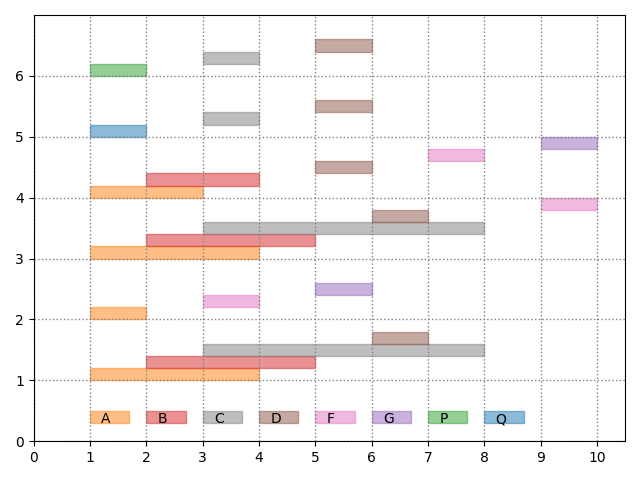

# Interval Event Miner

- Toy implementations of algorithms and utility tools for mining interval patterns.

## Visualize Transaction Event-List Database

- Implemented as **database.visualize()**

  - running example
  - 
